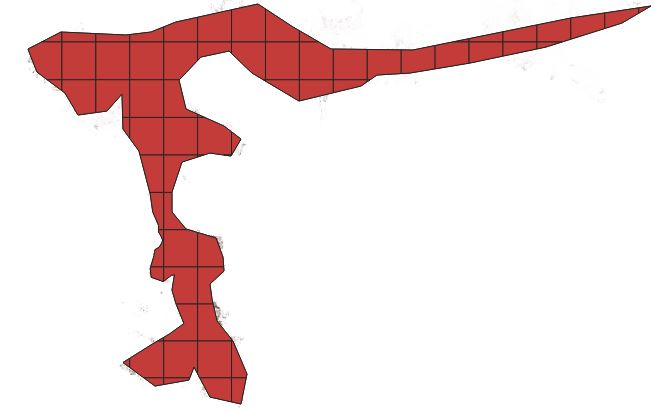

# TMS (tiled Map service) Downloader

## Step 1: Create AOI


## Step 2: Create Grid (50/50km) and Clip by AOI



## Dependencies Overview

| Package    | Version   | Default in Python? | Installation Required? | Description                                                                 |
|------------|-----------|---------------------|------------------------|-----------------------------------------------------------------------------|
| `rasterio` | 1.3.8     | ❌                 | ✅                     | A library for reading and writing geospatial raster data                    |
| `aiohttp`  | 3.8.5     | ❌                 | ✅                     | An asynchronous HTTP client/server framework                                |
| `imageio`  | 2.26.0    | ❌                 | ✅                     | A library for reading and writing a wide range of image data                |
| `geopandas`| 1.0.1     | ❌                 | ✅                     | An extension of pandas for working with geospatial data                     |
| `tqdm`     | 4.64.1    | ❌                 | ✅                     | A library for creating progress bars for loops                              |
| `asyncio`  | Built-in  | ✅ (Python ≥ 3.4)  | ❌                     | A standard library for writing asynchronous, non-blocking code              |
| `math`     | Built-in  | ✅                 | ❌                     | A standard library for mathematical functions (e.g., `sqrt`, `sin`, `log`)  |


You can install them using:
```bash
pip install rasterio==1.3.8 aiohttp==3.8.5 imageio==2.26.0 geopandas==1.0.1 tqdm==4.64.1
```

## Works with Multiple Map Layers – Just plug in the TMS link template you need, and go! 

   - **Google Maps** (Roads): `https://mt1.google.com/vt/lyrs=r&x={x}&y={y}&z={z}`
   - **Google Satellite**: `https://mt1.google.com/vt/lyrs=s&x={x}&y={y}&z={z}`
   - **Google Satellite Hybrid**: `https://mt1.google.com/vt/lyrs=y&x={x}&y={y}&z={z}`
   - **Google Terrain**: `https://mt1.google.com/vt/lyrs=p&x={x}&y={y}&z={z}`
   - **Google Roads Overlay**: `https://mt1.google.com/vt/lyrs=h&x={x}&y={y}&z={z}`
## Running the Script with User Inputs

Before running the script, make sure to review and set the user input parameters in `download_data_grid_wise.py`. 

### User Input Parameters
In the script, you can adjust the following parameters:

```python
# Define the base URL for the tiles
TILE_URL_TEMPLATE = "https://mt1.google.com/vt/lyrs=r&x={x}&y={y}&z={z}"

# Parameters
zoom_level = 16       # The zoom level for the tiles
n_tasks = 100         # Number of parallel download tasks

# Select output directory
output_folder = './output'  # Folder where downloaded data will be saved
```

To download data grid-wise, run the following command:

```bash
python download_data_grid_wise.py
```
